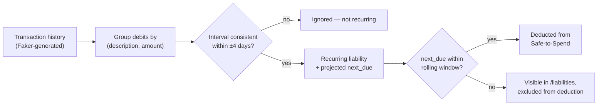

# PoC Report

> **Verdict:** The core hypothesis holds. Deterministic, zero-setup rules — no ML, no Open
> Banking — are sufficient to turn a raw ledger into a trustworthy, itemized forward-looking
> balance. 11/11 tests passing against the PRD's own acceptance criteria and edge cases.

| Initiative | Safe-to-Spend Engine |
| --- | --- |
| Stage | PoC — backend microservice only |
| Date & Version | 25.08.2026 v0.1 |
| Point of Contact | Bartosz DK |
| Repo | `app/` — Python 3.12, FastAPI, Docker |

## 1. What This PoC Was Built to Prove

The [Product Requirements Document](./Safe%20to%20Spend%20Product%20Requirements%20Document.md)
frames the business problem: static ledger balances cause defensive cash-hoarding (suppressing
interchange revenue) and drive "Where did my money go?" support volume. The PoC exists to
de-risk one question before any investment in design, front-end, or real Open Banking data:

> Can **deterministic pattern-matching alone** — no ML, no manual user setup — reliably separate
> a user's genuinely free-to-spend money from money already committed to upcoming bills?

Everything below is evidence for or against that question. Nothing else was in scope.

## 2. What Was Delivered vs. Planned

Scope was tracked against the [MVP Scope](./MVP%20Scope.md) MoSCoW. All Must-Haves shipped; both
undelivered Should-Haves are explicitly backlogged rather than silently dropped.

| Priority | Item | Status |
| --- | --- | --- |
| Must | Ingest mock transaction dataset (Faker-generated, Open Banking–shaped) | ✅ Delivered |
| Must | Deterministic recurring-bill detector (fixed-interval, fixed-amount) | ✅ Delivered |
| Must | 14-day rolling Safe-to-Spend calculation | ✅ Delivered |
| Must | REST endpoint returning balance, deduction, itemized upcoming bills | ✅ Delivered |
| Must | Dockerized, one-command run | ✅ Delivered |
| Should | Unit tests covering detection logic | ✅ Delivered — 11 tests, incl. PRD edge cases |
| Should | Confidence score per detected bill | ⏸ Backlog — not de-risking the core hypothesis |
| Should | `/transactions/seed` endpoint | ⏸ Backlog — dev convenience, not user-facing |
| Could | Configurable window via query param | ✅ Delivered (`?window_days=`) |
| Won't | ML, real Open Banking, multi-currency, auth, UI | Correctly excluded — v2 investment, not PoC risk |

## 3. How It Works



Four steps, all in `app/recurring.py`:

1. **Ingest** — synthetic transactions, shaped like Open Banking data (`data_generator.py`).
2. **Detect** — group debits by `(description, amount)`; flag as recurring if occurrence
   intervals are consistent within a ±4-day tolerance.
3. **Project** — extrapolate each recurring liability's next due date from its historical
   cadence.
4. **Deduct** — sum liabilities due within the rolling window (default 14 days);
   `safe_to_spend = ledger_balance − upcoming_liabilities`.

## 4. Proof It Works

**Automated evidence** — `uv run pytest`: **11/11 passing**, directly covering the PRD's own
acceptance criteria (US-1–3) and edge cases (Section 7): insufficient history, false-positive
one-off spending, variable-amount bills, and the day-14 rolling-window boundary.

**Live evidence** — real output from `GET /users/{id}/balance/safe` against a synthetic user
with three genuine recurring liabilities:

```json
{
  "as_of": "2026-08-25",
  "window_days": 14,
  "ledger_balance": 10904.45,
  "upcoming_liabilities": -2500.0,
  "safe_to_spend": 8404.45,
  "upcoming_bills": [
    {
      "description": "Rent",
      "amount": -2500.0,
      "interval_days": 30,
      "last_date": "2026-08-01",
      "next_due": "2026-08-31"
    }
  ]
}
```

This is the result worth pointing at: `/liabilities` for the same user detects **three**
recurring bills (Rent, Netflix, Internet & Phone), but only **Rent** falls inside the 14-day
window and gets deducted — Netflix (due 09-14) and Internet & Phone (due 09-19) sit just outside
it. The window logic isn't just summing everything it finds; it's correctly time-bounding the
deduction, which is the entire point of a *rolling* Safe-to-Spend figure rather than a static
"total monthly bills" number.

## 5. Known Limitations

4 gaps carried forward from the PRD's edge-case list — none block the PoC's verdict, all are
pilot-readiness items:

- **No amount tolerance.** Detection requires an *exact* amount match, so variable-amount bills
  (utilities, usage-based) aren't grouped at all — a genuine recurring bill with amount drift is
  invisible to the detector today.
- **Payee-name inconsistency isn't normalized.** "NETFLIX.COM" vs "Netflix" would be treated as
  two unrelated payees.
- **No cancellation handling.** A subscription cancelled by the user but still present in
  history keeps projecting forward until it ages out of the interval pattern.
- **Detection threshold is 2 occurrences, not 3.** The PRD's original US-2 stated a
  3-occurrence minimum; the shipped detector uses 2 (documents actual behavior — corrected in
  the PRD on 2026-08-25 rather than left as silent drift).

## 6. What This Means for the Business

The PoC's job was to answer one yes/no question before committing design, engineering, and
compliance effort to a real pilot: **it's a yes.** Deterministic detection produces an
explainable, auditable, itemized Safe-to-Spend figure with zero user setup — directly serving
the JTBDs in the PRD (Section 4) without the training data, retraining infrastructure, or
opacity that an ML approach would require at this stage.

**To progress from PoC to pilot**, the recommended next investments — in priority order — are:

1. Amount-tolerance banding, to close the variable-bill gap (the single largest false-negative
   risk against the <2% false-positive guardrail).
2. Payee-name normalization, ahead of any real transaction data.
3. Front-end surfacing (Design-owned dependency, already flagged in PRD Section 8) — needed
   before any of the OKR's adoption/engagement instrumentation (`sts_card_viewed`,
   `sts_breakdown_expanded`) can fire.

## Related Documents

1. [Market Research Report](./Market%20Research%20Report.md)
2. [Product Requirements Document](./Safe%20to%20Spend%20Product%20Requirements%20Document.md)
3. [MVP Scope](./MVP%20Scope.md)
